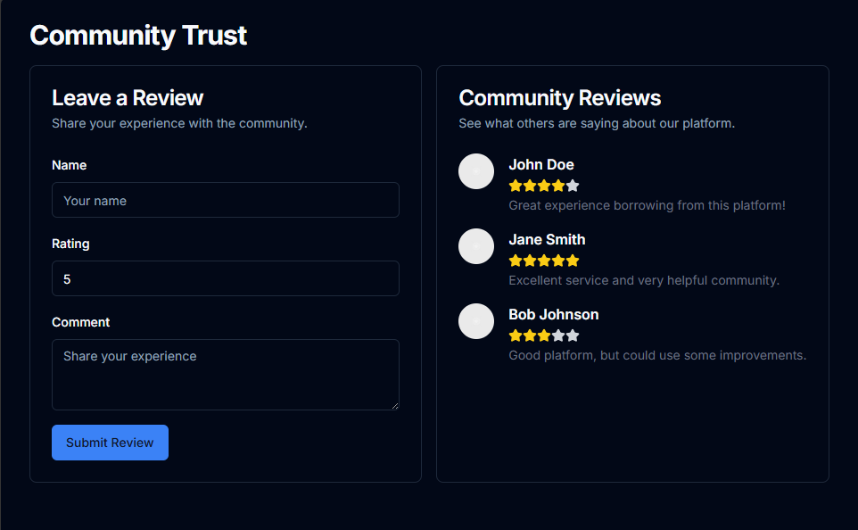

# Lendr

This is a prototype for a Peer-to-Peer (P2P) Lending Platform aimed at providing loans to individuals who are typically excluded from traditional banking, such as freelance and gig workers.

## Features

### 1. **Custom Credit Scoring Model**
   - Evaluates borrowers using alternative data, such as:
     - **On-time Rent Payments**
     - **Utility Bill Payments**
     - **Freelance/Gig Work History**

### 2. **Risk Assessment Model**
   - Provides a risk score based on credit history, income stability, and financial health.

### 3. **Blockchain for Smart Contracts**
   - **Smart Contracts**: Automatically enforce loan terms, ensuring transparency and security.
   - **Tokenized Loans**: Enable crowdfunding for loans through tokenization, allowing global investment.

### 4. **Financial Literacy Chatbot**
   - Offers users guidance on understanding credit, budgeting, and loan terms in an easy-to-understand format.

# Prototype 

## 1. Signup/Signin

This page handles the user authentication, allowing users to either sign up for a new account or sign in to an existing one. It includes:
- **Signup Form**: For new users to create an account.
- **Signin Form**: For returning users to log in.

## 2. KYC (Know Your Customer)

The KYC page is where users will go through the process of verifying their identity. This page may include:
- **Document Upload**: Users can upload identity proof.
- **Selfie Verification**: A photo verification step.
- **Personal Information**: Details like name, address, etc.

## 3. Dashboard

The Dashboard provides users with a personalized view of their financial activities and overview. It may include:
- **Balance Summary**: A snapshot of the user’s current balance.
- **Recent Transactions**: A list of the most recent financial activities.
- **Account Details**: Detailed information about the user’s accounts.

## 4. Loan Application

This page allows users to apply for a loan. It typically includes:
- **Loan Amount**: User selects or enters the desired loan amount.
- **Repayment Terms**: Options for loan repayment duration.
- **Eligibility Check**: A brief evaluation of whether the user qualifies for the loan.

## 5. Lending

The Lending page lets users participate in lending money to others, earning interest in return. It may contain:
- **Browse Loan Requests**: View available loan applications from other users.
- **Investment Options**: Choose how much money to lend and at what terms.
- **Loan Risk Assessment**: Information to help evaluate the risk involved.

## 6. Financial Literacy Chatbot

This interactive chatbot helps users learn about personal finance, budgeting, and other financial topics. It includes:
- **FAQ Assistance**: Answering common financial questions.
- **Learning Modules**: A guided learning experience about managing money.
- **Live Chat Option**: For personalized financial advice.

## 7. Community Page

The Community page enables users to engage with other members of the platform. It features:
- **Discussion Forum**: Users can participate in financial discussions and share advice.
- **Event Calendar**: Information on upcoming webinars, workshops, or community events.
- **Groups**: Join specific interest-based groups for discussions.

## 8. Analytics

The Analytics page provides in-depth financial insights and data visualization. It includes:
- **Spending Analysis**: Visual graphs showing user spending patterns.
- **Investment Portfolio**: Breakdown of all the investments made by the user.
- **Financial Goals Progress**: Track the progress towards personal financial goals.

